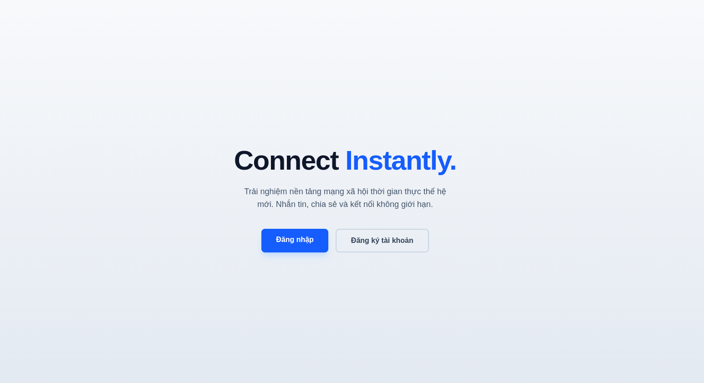
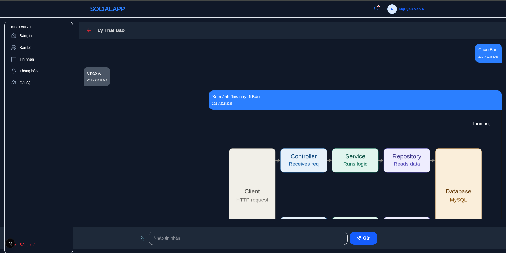
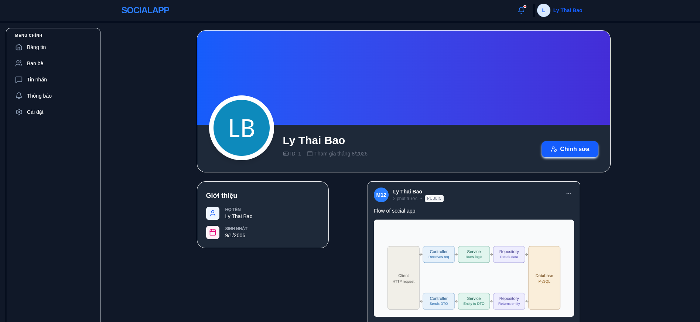
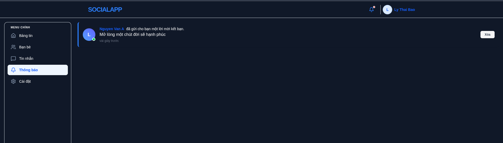
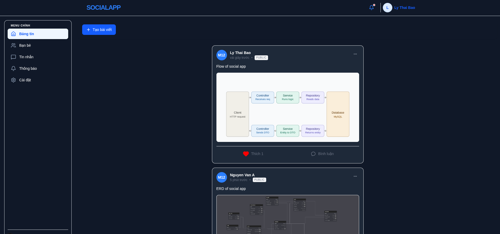

# 🌐 Social Connect — Frontend


> ⚠️ **This project is currently under active development.**

## 📖 Overview

This is the **Frontend** for **Social Connect** — a social networking app that lets users add friends, chat, create posts, and interact with each other. This repository builds the user interface and communicates with the Backend API over REST.

🔗 Backend repo: [social-connect-backend](https://github.com/LyThaiBao/Social_App)

## 📸 Screenshots

| Landing | Chat | Profile | Notification | Posts |
|---|---|---|---|---|
|  |  |  |  |  |


## ✨ Key Features

- 🤝 **Friend system** — send/accept friend requests
- 💬 **Messaging** — direct chat between users
- 📝 **Posts** — create and share content
- ❤️ **Likes** — react to posts
- 💭 **Comments** — discuss under posts
- 🔍 **Friend search** — find and connect with other users

## 🛠️ Tech Stack

| Layer | Technology |
|---|---|
| **Framework** | Next.js (TypeScript) |
| **Form handling** | React Hook Form (RHF) |
| **HTTP client** | Axios |
| **Schema validation** | Zod |
| **Tools** | Git, GitHub |

## 🏗️ Architecture Highlights

- ✅ **Type-safe** codebase built with TypeScript
- 📋 **Efficient form handling** with React Hook Form, minimizing unnecessary re-renders
- 🛡️ **Strict input validation** using Zod before sending requests to the Backend
- 🔄 **API communication** via Axios, in sync with the Backend's JWT + Token Rotation authentication flow

## 📁 Project Structure (simplified)

```
src/
├── app/         # Routing via Next.js App Router
├── (dashboard)/ # Dashboard route group / layout
├── api/         # API route handlers
├── auth/        # Authentication logic
├── context/     # React context providers
├── enum/        # Shared enums
├── hooks/       # Custom React hooks
├── service/     # API service calls (Axios)
├── types/       # TypeScript type definitions
├── utils/       # Helper functions
└── proxy.ts     # Request proxy config
```

## 🚀 How to Run Locally

### 1. Clone the repository
```bash
git clone https://github.com/LyThaiBao/social_app-FE-.git
cd social-connect-frontend
```

### 2. Install dependencies
```bash
npm install
```

### 3. Configure environment variables

Create a `.env.local` file based on the `.env.example` template:
```env
BACKEND_URL="http://localhost:8080"
NEXT_PUBLIC_FRONTEND_URL="http://localhost:3000"
NEXT_PUBLIC_WS_URL="http://localhost:3000/ws"
```

> ⚠️ The **Backend** must be running first for the API to work (default: `http://localhost:8080/api`).

### 4. Run the application
```bash
npm run dev
```

Available at: `http://localhost:3000`

## 📄 License

All rights reserved by Timmy.
